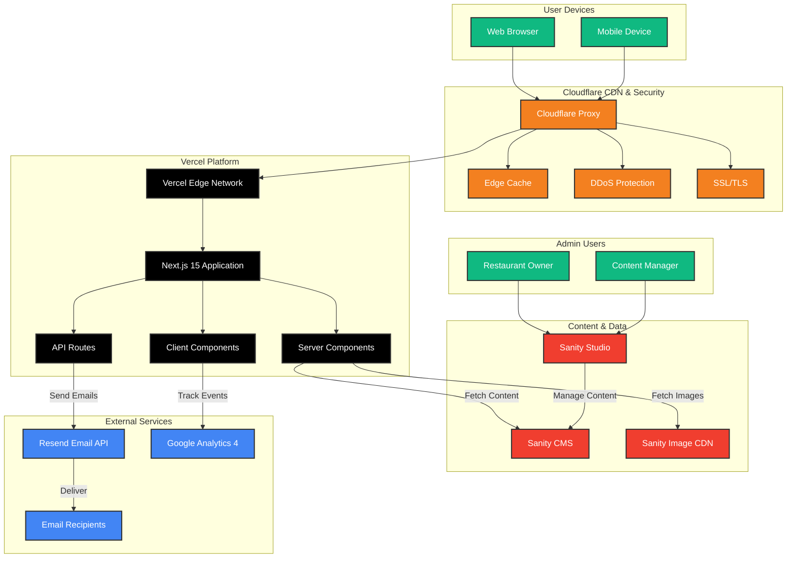

# ChrisCakes - Modern Website with CMS

A modernized website for ChrisCakes of Michigan, built with Next.js 15 and Sanity CMS, enabling non-technical owners to manage content independently.

## 🚀 Quick Start

### Prerequisites
- Node.js 18.x or higher
- npm or yarn
- Git
- Sanity account (free tier available)

### Development Setup

1. **Install dependencies**:
   ```bash
   npm install
   ```

2. **Configure environment variables**:
   ```bash
   cp .env.local.example .env.local
   ```

   Edit `.env.local` with your Sanity credentials (see [SETUP.md](./SETUP.md) for details)

3. **Run development server**:
   ```bash
   npm run dev
   ```

4. **Visit the site**:
   - Website: http://localhost:3000
   - Sanity Studio: http://localhost:3000/studio

## 📖 Documentation

### For Developers
- **[SETUP.md](./SETUP.md)** - Complete setup instructions, Sanity authentication, and **Vercel deployment guide**
- **[IMPLEMENTATION_PLAN.md](./IMPLEMENTATION_PLAN.md)** - Project roadmap and implementation details
- **[CONTENT_AUDIT.md](./reference/CONTENT_AUDIT.md)** - Content inventory from original site
- **[CLAUDE.md](./CLAUDE.md)** - AI assistant guidance and project conventions

### For Site Managers
- **[User Guides](./user-guides/)** - Complete guides for managing the website through Sanity Studio
  - [Getting Started](./user-guides/GETTING_STARTED.md) - Learn the basics and make your first update
  - [Managing Menu Items](./user-guides/managing-menu-items.md) - Add, edit, and update menu items
  - [Managing Categories](./user-guides/managing-categories.md) - Organize your menu sections
  - [Updating Site Settings](./user-guides/updating-site-settings.md) - Change hours, contact info, social media
  - [Managing Testimonials](./user-guides/managing-testimonials.md) - Add customer reviews
  - [Editing Pages](./user-guides/editing-pages.md) - Update About, Services, and other pages
  - [Contact Form Guide](./user-guides/contact-form-guide.md) - Understanding form submissions and email replies

## 🏗️ Complete Tech Stack

### Core Technologies

| Category | Technology | Purpose | Cost |
|----------|-----------|---------|------|
| **Framework** | [Next.js 15](https://nextjs.org) | React framework with App Router, SSR, and ISR | Free |
| **Language** | [TypeScript](https://www.typescriptlang.org) | Type-safe JavaScript | Free |
| **Styling** | [Tailwind CSS v4](https://tailwindcss.com) | Utility-first CSS framework | Free |
| **CMS** | [Sanity.io](https://www.sanity.io) | Headless CMS for content management | Free tier (3 users) |
| **Deployment** | [Vercel](https://vercel.com) | Serverless deployment platform | Free tier (hobby) |
| **CDN/Security** | [Cloudflare](https://www.cloudflare.com) | DDoS protection, CDN, DNS | Free tier |
| **Email** | [Resend](https://resend.com) | Transactional email API | Free tier (3k emails/month) |
| **Analytics** | [Google Analytics 4](https://analytics.google.com) | User behavior and traffic analytics | Free |
| **Image CDN** | Sanity CDN | Image optimization and delivery | Included with Sanity |
| **Version Control** | [Git](https://git-scm.com) / GitHub | Source code management | Free |

### Development Tools

| Tool | Purpose |
|------|---------|
| **ESLint** | JavaScript/TypeScript linting |
| **Prettier** | Code formatting |
| **next/font** | Automatic font optimization |
| **next/image** | Automatic image optimization |

### Architecture Diagram



### How It All Works Together

#### 1. **Request Flow** (User Visits Site)
```
User Browser → Cloudflare CDN → Vercel Edge → Next.js App → Sanity CMS
```
- User requests a page (e.g., `/menu`)
- **Cloudflare** proxies the request, provides DDoS protection and SSL
- **Vercel** receives the request at the edge location closest to the user
- **Next.js** server components fetch data from **Sanity CMS**
- Page is rendered and cached, then returned to user via **Cloudflare CDN**

#### 2. **Content Management Flow**
```
Restaurant Owner → Sanity Studio → Sanity CMS → Website (auto-updates)
```
- Owner logs into **Sanity Studio** at `/studio`
- Updates menu items, prices, or content
- Changes are saved to **Sanity CMS**
- Website automatically fetches new content within 60 seconds (ISR)

#### 3. **Contact Form Flow**
```
User Submits Form → API Route → Resend API → Email Recipients
```
- User fills out contact form on `/contact`
- Form data sent to **Next.js API route** (`/api/contact`)
- API validates data, checks rate limits
- **Resend API** sends formatted email to configured recipients
- **Google Analytics** tracks form submission as conversion event

#### 4. **Analytics Flow**
```
User Interactions → Google Analytics → GA4 Dashboard
```
- **GA4 tracking script** loads on every page
- Tracks pageviews, events, conversions
- Data sent to **Google Analytics** for analysis
- Restaurant owner views reports in GA4 dashboard

#### 5. **Image Delivery Flow**
```
Sanity Image → Sanity CDN → Cloudflare Cache → User
```
- Images uploaded to **Sanity CMS**
- Served via **Sanity CDN** with automatic optimization
- Cached by **Cloudflare** at edge locations
- Delivered to users with optimal format (WebP, AVIF)

### Why This Stack?

| Benefit | Technology | Impact |
|---------|-----------|--------|
| **Zero Hosting Costs** | Vercel Free Tier | Suitable for small business traffic |
| **Content Independence** | Sanity CMS | Owner updates content without developer |
| **Global Performance** | Cloudflare CDN | Fast page loads worldwide |
| **DDoS Protection** | Cloudflare | Site stays online during attacks |
| **Instant Updates** | Next.js ISR | Content changes appear within 60 seconds |
| **Email Reliability** | Resend | Professional transactional emails |
| **Data Insights** | Google Analytics 4 | Understand visitor behavior |
| **SEO Optimized** | Next.js SSR | Better search engine rankings |
| **Mobile First** | Responsive Design | Works perfectly on all devices |
| **Type Safety** | TypeScript | Fewer bugs, better code quality |

### Performance Features

- **Edge Caching**: Static assets cached at 200+ Cloudflare locations
- **ISR**: Pages regenerate every 60 seconds with fresh content
- **Image Optimization**: Automatic WebP/AVIF conversion, lazy loading
- **Code Splitting**: JavaScript bundles split per page for faster loads
- **Brotli Compression**: Better compression than gzip (via Cloudflare)
- **HTTP/3**: Latest protocol support (via Cloudflare)
- **Server Components**: Less JavaScript sent to browser

### Security Features

- **DDoS Protection**: Cloudflare's network absorbs attacks
- **SSL/TLS**: End-to-end encryption (Cloudflare + Vercel)
- **Rate Limiting**: Contact form limited to 3 submissions/hour/IP
- **Bot Protection**: Cloudflare Bot Fight Mode blocks malicious bots
- **CORS Protection**: Sanity API locked to specific domains
- **Environment Variables**: Sensitive keys stored securely in Vercel
- **Input Validation**: All form inputs sanitized and validated

## 📁 Project Structure

```
chriscakes/
├── app/                    # Next.js pages (App Router)
│   ├── page.tsx           # Homepage
│   ├── menu/              # Menu page
│   ├── services/          # Services page
│   ├── about/             # About page
│   ├── contact/           # Contact page with form
│   ├── how-to-book/       # Booking information
│   ├── day-of-event/      # Day-of-event instructions
│   ├── fundraising/       # Fundraising services
│   ├── fundraising-tips/  # Fundraising tips
│   ├── volunteers/        # Volunteer information
│   ├── invoice-payment/   # Invoice payment info
│   ├── api/              # API routes
│   │   └── contact/      # Contact form email handler
│   └── studio/           # Sanity Studio
├── components/           # React components
│   ├── layout/          # Header, Footer
│   ├── menu/            # Menu components
│   └── contact/         # Contact form
├── lib/                 # Utilities
│   ├── sanity.ts       # Sanity client
│   └── queries.ts      # GROQ queries
├── sanity/             # Sanity configuration
│   └── schemas/        # Content schemas
├── public/             # Static assets
└── scripts/           # Import scripts
```

## 🎨 Features

- ✅ Fully responsive design with mobile hamburger menu
- ✅ Real-time content management via Sanity Studio
- ✅ Dynamic menu with category filtering
- ✅ "Call for pricing!" display for custom-priced items
- ✅ **Contact form with email notifications** (Resend API)
- ✅ Rate limiting and spam protection
- ✅ Comprehensive event booking form
- ✅ Image optimization and CDN delivery
- ✅ Incremental Static Regeneration (ISR)
- ✅ TypeScript for type safety
- ✅ SEO-friendly with proper meta tags
- ✅ Fast builds with webpack

## 🚢 Deployment

### Quick Deploy to Vercel

See [SETUP.md - Deployment to Vercel](./SETUP.md#deployment-to-vercel) for comprehensive deployment instructions including:

- **Web Dashboard deployment** (easiest)
- **CLI deployment** (for automation)
- **Staging/Preview deployments** (automatic for branches & PRs)
- **Custom domain setup**
- **Environment variable configuration**
- **CORS configuration for Sanity**

**Quick Deploy Button**:

[](https://vercel.com/new/clone?repository-url=https://github.com/yourusername/chriscakes-new)

### Environment Variables for Deployment

Required environment variables (add these in Vercel):

```env
# Sanity CMS
NEXT_PUBLIC_SANITY_PROJECT_ID=your_project_id
NEXT_PUBLIC_SANITY_DATASET=production
NEXT_PUBLIC_SANITY_API_VERSION=2024-01-01
SANITY_API_TOKEN=your_api_token

# Site Configuration
NEXT_PUBLIC_SITE_URL=https://your-domain.com

# Email Notifications (Contact Form)
RESEND_API_KEY=your_resend_api_key
RESEND_FROM_EMAIL=your_verified_sender@yourdomain.com
CONTACT_EMAIL_TO=recipient@example.com (fallback if not configured in Sanity)
```

## 📝 Available Scripts

- `npm run dev` - Start development server
- `npm run build` - Build for production
- `npm start` - Start production server
- `npm run lint` - Run ESLint
- `npm run format` - Format code with Prettier
- `npm run format:check` - Check formatting
- `npm run import:all` - Import all content to Sanity

## 🎯 Content Management

### Sanity Studio

Access the Sanity Studio at `/studio` to manage:

- **Menu Items** - Add, edit, delete menu items with prices and images (use $0 for "Call for pricing!")
- **Menu Categories** - Organize menu items by category
- **Pages** - Edit content for About, Services, How to Book, Fundraising, etc.
- **Site Settings** - Update contact info, hours, social media, contact form recipients

### Content Types

1. **Menu Category** - Breakfast, Lunch, Dinner, etc.
2. **Menu Item** - Individual items with name, price, description, image (displays "Call for pricing!" when price is $0)
3. **Page** - Dynamic pages with rich text content
4. **Site Settings** - Global site configuration including contact form email recipients
5. **Testimonial** - Customer testimonials
6. **FAQ** - Frequently asked questions

### Contact Form Configuration

The contact form sends email notifications via [Resend](https://resend.com). To configure:

1. Sign up for a free Resend account
2. Verify your sending domain or use their test domain
3. Get your API key and add to environment variables
4. Configure recipient emails in Sanity Studio (Site Settings → Contact Form Recipients)
5. Form includes rate limiting (3 submissions/hour per IP) and validation

## 🔧 Development

### Code Quality

```bash
# Format all files
npm run format

# Check formatting
npm run format:check

# Run linter
npm run lint
```

### Building Locally

```bash
# Test production build
npm run build

# Run production build
npm start
```

## 🐛 Troubleshooting

Common issues and solutions:

### Build Fails
- Check environment variables are set correctly
- Ensure all dependencies are installed: `npm install`
- Clear Next.js cache: `rm -rf .next`

### Sanity Connection Issues
- Verify Sanity project ID and API token
- Check CORS settings in Sanity dashboard
- Ensure environment variables start with `NEXT_PUBLIC_` for client-side access

### Image Optimization Errors
- Confirm `cdn.sanity.io` is in `next.config.ts` allowed domains
- Verify images are uploaded to Sanity CDN

See [SETUP.md](./SETUP.md) for more troubleshooting help.

## 📊 Project Status

**Current Phase**: Production-Ready ✅

- ✅ Phase 1: Project Setup & Planning
- ✅ Phase 2: CMS Schema Design
- ✅ Phase 3: Content Migration
- ✅ Phase 4: Frontend Development
- ✅ Phase 5: Contact Form & Email Integration
- ✅ All core features implemented and functional
- 🚀 Ready for production deployment

### Recent Updates
- ✅ Full-featured contact form with email notifications
- ✅ "Call for pricing!" display for menu items
- ✅ All content pages from original site migrated
- ✅ Comprehensive event booking workflow

## 🤝 Contributing

This is a private project for ChrisCakes of Michigan. For questions or support, contact the development team.

## 📄 License

Proprietary - ChrisCakes of Michigan

## 🔗 Resources

- [Next.js Documentation](https://nextjs.org/docs)
- [Sanity Documentation](https://www.sanity.io/docs)
- [Tailwind CSS Documentation](https://tailwindcss.com/docs)
- [Vercel Documentation](https://vercel.com/docs)

---

**Built with ❤️ for ChrisCakes of Michigan**
