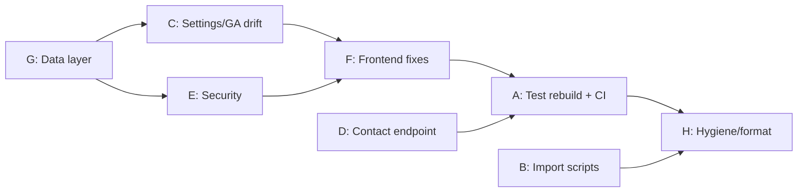

# ChrisCakes Remediation Design Plan

**Date:** 2026-07-26
**Input:** `CODE_REVIEW.md` (full-project review, 2026-07-26)
**Status:** Draft — pending review

## Goals

1. Make the project safe to hand to a non-technical owner: no documented command destroys content, no CMS edit crashes a page, no Studio knob silently does nothing.
2. Make the test suite trustworthy: `npm test` passes on a fresh checkout against the real site, and runs automatically in CI.
3. Harden the public surface: contact endpoint abuse resistance, security headers, XSS vectors closed, dependency vulnerabilities addressed.
4. Remove all dead weight: unused features, dead components, stale boilerplate, formatting debt.

## Non-Goals

- No visual redesign or new features. This is remediation only.
- No external service signups (Turnstile, Upstash, etc.) — spam defense uses honeypot + hardening only (owner decision).
- No visual regression testing — the suite is deleted, not fixed (owner decision).
- No changes to hosting/deployment architecture (stays Vercel + embedded Studio).

## Settled Decisions

| Decision                                                                                                   | Choice                                                           |
| ---------------------------------------------------------------------------------------------------------- | ---------------------------------------------------------------- |
| Unrendered social features (UGC gallery, review widgets, click-to-tweet, Pinterest boards, Instagram feed) | **Delete entirely** — schema fields, components, and queries     |
| Contact form spam defense                                                                                  | **Honeypot + hardening** — no external services                  |
| Visual regression suite                                                                                    | **Delete** `tests/visual/` and its npm script wiring             |
| Scope                                                                                                      | **Everything** in the review: Critical/High/Medium/Low + hygiene |

---

## Workstream A — Test Suite Rebuild & CI

**Problem:** Six-plus tests fail unconditionally against real markup, several assertions are vacuous, visual baselines don't exist, the contact form has zero coverage, and nothing runs in CI. (Review H3.)

**Design:**

- **Delete** `tests/visual/` entirely; remove `test:visual` from `package.json` and from the default `npm test` aggregation.
- **Rewrite e2e specs against the real markup**, not aspirational markup:
  - Footer/contact assertions use the real data (`989-802-0755`, Clare MI) — or better, assert structure (a `tel:` link exists) rather than CMS-editable values, so owner edits don't break tests.
  - Navigation tests use the real link names ("On the Flip Side", "Menus", "Contact Us") with `exact: true` or scoped locators (`page.getByRole('navigation')…`) to avoid strict-mode multi-matches.
  - Menu tests target real selectors. Where the markup lacks a stable hook, **change the markup**: add `data-testid="menu-item"` to `MenuItemCard`, and add the semantic improvements the tests expected — `aria-current="page"` on active nav links, `aria-pressed` on category filter buttons (these are also a11y findings; the tests were right, the markup was wrong).
  - Replace every `waitForTimeout` with condition-based waits (`expect(locator).toBeVisible()`, `waitForResponse`, etc.).
  - Restrict full-nav click-through tests to desktop projects; mobile projects get a dedicated hamburger-menu flow test.
- **Content-tolerant assertions:** tests must not depend on specific Sanity content (category names, item counts > N, the `/about` document existing). Assert shapes ("at least one category button", "menu grid renders") not values. Where a page must exist (e.g. `[slug]` route smoke test), fetch the first published slug dynamically in the test.
- **New coverage (the gaps):**
  - Contact form: fill/submit happy path with the API mocked via `page.route()`; client-side validation errors; honeypot field is present and hidden. Plus API-level tests for `app/api/contact/route.ts` (validation rejections, honeypot rejection, method restriction) using direct `request` fixtures with Resend mocked/absent.
  - Menu search, sort, and print button in `MenuDisplay`.
  - 404 handling: unknown `[slug]` returns 404 (requires Workstream F's `notFound()` fixes); add an `app/not-found.tsx`.
  - `/fundraising` smoke test.
- **Fix vacuous assertions:** delete the hardcoded `calculateContrastRatio` (axe already covers contrast); replace `activeElement` truthiness checks with assertions that focus actually moved to a specific element; delete unused helpers (`checkConsoleErrors`, `isInViewport`, etc.) or rewrite the console-error test to register listeners before navigation.
- **Touch targets:** fix `CategoryFilter` buttons to ≥44px (the a11y test was catching a real defect) rather than weakening the test.
- **CI:** add `.github/workflows/ci.yml` running on PR + push to master: install, `lint`, `format:check`, `build`, then Playwright (chromium + one mobile project only in CI for speed; full matrix stays available locally). Cache npm + Playwright browsers. Tests run against `next build && next start`, not the dev server.

**Acceptance:** `npm test` green on a fresh checkout with the production build; CI workflow green; no `waitForTimeout` calls remain; no test references CMS-editable literal content.

---

## Workstream B — Import Script Safety

**Problem:** `npm run import:all` destroys live site settings (stale schema shape, missing fields) and duplicates the entire catalog on re-run. (Review H2.)

**Design:**

- **Reframe the scripts as one-time migration tools, not routine commands.** They already served their purpose (the content is live). The design is to defang, not perfect, them:
  - Update the `siteSettings` payloads in `import-all-content.ts` / `import-content.ts` to the **current** schema shape (`socialMedia.platforms[]`, include `contactFormRecipients`, etc.), and switch `createOrReplace` → `createIfNotExists` so an existing live document is never overwritten.
  - Switch all `client.create()` calls to deterministic `_id`s (e.g. `menuItem-<slug>`) with `createIfNotExists` — re-runs become no-ops instead of duplicators.
  - Fix `price: null` writes: either omit the field or relax the schema (see Workstream G — schema will make `price` optional to support "call for pricing" items, which is the real-world requirement).
  - Add a top-of-script guard: refuse to run unless `--yes` is passed, and print which project/dataset will be written first.
  - Fix `import-page-content.ts` swallowing per-page errors: track failures, exit non-zero, and report accurately.
- **Documentation:** CLAUDE.md and SETUP.md stop presenting `import:all` as a routine command; it's documented as "initial migration, safe to re-run, will not touch existing documents."

**Acceptance:** running `import:all` twice against a scratch dataset produces zero duplicates and leaves a pre-existing `siteSettings` document untouched; running without `--yes` aborts.

---

## Workstream C — Settings & CMS Drift (incl. Google Analytics)

**Problem:** GA can never load; the contact page reads a nonexistent socialMedia shape; four features are configurable in Studio but never rendered; header/footer content is hardcoded while the contact page is CMS-driven. (Review H1 + Medium drift cluster.)

**Design:**

- **Google Analytics — fix all four defects as one unit:**
  - Add `analytics` to `siteSettingsQuery` projection.
  - Wrap the `<GoogleAnalytics>` usage in `<Suspense>` in `app/layout.tsx` (required for `useSearchParams` under static prerendering).
  - Rewrite the component: single `gtag('config')` source of truth — initial script does `config` with `send_page_view: false`, the effect sends page views on route change with a correctly-joined `pathname + '?' + searchParams` path (omit `?` when empty).
  - Validate the CMS-sourced ID against `/^G-[A-Z0-9]+$/` before rendering anything.
- **Delete the dead social features** (owner decision): remove `ugcGallery`, `reviewWidgets`, `clickToTweet`, `pinterestBoards`, and the Instagram `embedCode` fields from `siteSettings.ts`; delete `UGCGallery.tsx`, `ReviewWidgets.tsx`, `ClickToTweet.tsx`, `PinButton.tsx`, `PinnableImage.tsx`, `PinterestBoardWidget.tsx`, `InstagramFeed.tsx`, `ShareButtons.tsx` if unused, and the dead contact-page "Follow Us" flat-shape branch. The contact page's social section is rewritten against `socialMedia.platforms[]` (the real shape) — social _links_ stay, embedded _feeds_ go.
- **Header/Footer become CMS-driven for contact data:** the root layout already fetches `siteSettings` — pass phone/email/address down to `Header`/`Footer` as props, replacing the hardcoded values. Footer quick-links fixed to the real routes (`/how-to-book`, `/day-of-event`).
- **Fundraising page:** remove the duplicated-section rendering (filter the subtitle section out before `SectionRenderer`, or stop extracting it); remove the hardcoded `'Hot Dog Bash'` name check — render the fetched items generically with their real `price` field ("Call for pricing" when price is absent, matching the schema change in G).
- **Singleton enforcement for `siteSettings`:** custom structure in `sanity.config.ts` pinning Site Settings to a single document ID and removing "create new" for that type.
- **Delete the `test-dynamic-page` document** from the production dataset (one-off script or manual Studio deletion during execution).

**Acceptance:** enabling GA in Studio loads gtag with one pageview per navigation and the build still passes; every field remaining in `siteSettings.ts` is projected by a query and rendered somewhere; editing phone/email in Studio updates header, footer, and contact page; Studio cannot create a second settings document.

---

## Workstream D — Contact Endpoint Hardening

**Problem:** Rate limiting is bypassable (client-controlled XFF) and per-instance; endpoint is scriptable with zero friction; unvalidated field types/lengths; newline injection into subject. (Review H4 + Lows.)

**Design (honeypot + hardening, no external services):**

- **Honeypot:** add a visually-hidden field (`website`) to `ContactForm` (CSS-hidden, `tabIndex={-1}`, `autoComplete="off"`, `aria-hidden`). Server rejects any submission where it's non-empty — but returns the normal success response (bots shouldn't learn they were caught).
- **Trusted IP extraction:** on Vercel, use `x-vercel-forwarded-for` / the rightmost `x-forwarded-for` entry. Keep the in-memory limiter as best-effort defense-in-depth (documented as such), with a max-size cap + periodic pruning on the Map so it can't grow unbounded.
- **Minimum-fill-time check:** form includes a rendered-at timestamp (signed with a server secret or simply opaque); submissions completing in under ~3 seconds are treated as bots (same silent-success response).
- **Input validation:** every field validated for type (string), trimmed, and length-capped (name ≤ 100, email ≤ 254 + regex, message ≤ 5000, etc.); `[\r\n]` stripped from anything interpolated into the subject line; booleans coerced explicitly. Reject payloads over a total size cap.
- **Same-origin check:** verify `origin`/`referer` host matches the deployment host when present (absent headers allowed — legacy clients — since honeypot + timing are the primary gate).

**Acceptance:** a plain `curl` POST with instant timing or filled honeypot sends no email but receives a success response; legitimate form use is unaffected; a subject-injection payload arrives as a single sanitized line; API tests from Workstream A cover all rejection paths.

---

## Workstream E — Site-Wide Security Hardening

**Problem:** No security headers/CSP; JSON-LD injection vector; client bundle one refactor from shipping the write token; over-broad image remotePatterns; no robots/sitemap; 1 critical + 25 high dependency vulns. (Review H7 + Medium security cluster.)

**Design:**

- **Security headers** via `headers()` in `next.config.ts`:
  - `X-Content-Type-Options: nosniff`, `Referrer-Policy: strict-origin-when-cross-origin`, `X-Frame-Options: DENY` (with a `/studio` carve-out only if Studio breaks — verify during implementation; Studio runs same-origin so DENY should be fine).
  - CSP in **Report-Only mode is not needed** — with the embed features deleted (Workstream C), the surface is small enough for a real CSP: `default-src 'self'`, allowances for `cdn.sanity.io` (img), Google Analytics hosts (script/connect, only needed once GA works), YouTube (frame, for `VideoSection`), and the inline-script hashes/`'unsafe-inline'` compromise Next.js requires. Studio route may need a relaxed policy — scope by path.
- **SchemaMarkup XSS + SSR fix:** render JSON-LD inline in server components via `<script type="application/ld+json">` with `JSON.stringify(data).replace(/</g, '\\u003c')` — present in initial HTML, escape-proof. Drop the `next/script` `afterInteractive` approach.
- **Token isolation:** `lib/sanity.ts` becomes token-free (public reads need none — dataset is public). Anything that genuinely needs the token (none of the app routes do; only `scripts/`) constructs its own client. Remove the token-configured client from any path importable by client components. Delete the competing boilerplate clients in `sanity/lib/` (see Workstream G) so there is exactly one app client.
- **`useCdn: false`** on the app client — correct pairing with ISR, removes the stacked-TTL staleness.
- **Image remotePatterns:** scope to `pathname: '/images/0fl6fs6u/**'` — but sourced from the env var at config time so it can't drift from the project ID.
- **robots + sitemap:** add `app/robots.ts` (`Disallow: /studio`, `/api/`) and `app/sitemap.ts` (static routes + published `[slug]` pages from Sanity).
- **Dependencies:** `npm audit fix` (non-breaking); for anything remaining, evaluate `sanity`/`next-sanity` minor upgrades. Verify Studio loads and the build passes afterward. Document any residual unfixable transitive advisories.

**Acceptance:** securityheaders.com-style check shows the header set on all routes; Studio still loads; JSON-LD visible in `curl` output of the homepage; grep confirms no token reference reachable from client components; `npm audit --omit=dev` shows no critical/high (or documented residuals with justification).

---

## Workstream F — Frontend Correctness & Accessibility

**Problem:** Pages 500 on missing CMS docs; skip-link invisible; PortableText link crash; hamburger/filter a11y gaps; image sizing; fetch waterfall. (Review H5, H6 + Medium/Low frontend cluster.)

**Design:**

- **Missing-document resilience:** `app/services/page.tsx` and `app/fundraising/page.tsx` adopt the same pattern as `app/[slug]/page.tsx` — null-check the fetched page and call `notFound()`, in both `generateMetadata` and the page body. Add `app/not-found.tsx` with a branded 404.
- **SkipToContent:** replace `crimson-*` classes with real values (`focus:bg-[#dc143c]`); audit-and-fix the same nonexistent-palette classes in `MenuDisplay` (`focus:ring-crimson-500`) — repo-wide grep for `crimson-` after the dead-component deletion.
- **PortableTextRenderer:** guard the link mark (`if (!value?.href) return children`); fix the external-link detection accordingly.
- **VideoSection:** replace the positional regex with `URL`/`searchParams` parsing so `watch?feature=share&v=ID` works.
- **Header a11y:** `aria-expanded` + `aria-controls` on the hamburger, Escape closes the menu, focus returns to the button on close. (Full focus-trap is overkill for a nav panel; Escape + expanded state is the right scope.)
- **CategoryFilter a11y:** `aria-pressed` on filter buttons + ≥44px touch targets (pairs with Workstream A's test).
- **ContactForm status:** `role="status"` / `aria-live="polite"` on the result message, focus moved to it on completion.
- **Images:** add `sizes` to every `fill` image; `TwoColumnSection` and `PortableTextRenderer` images get `urlFor(...).width(1200).url()` caps.
- **Homepage:** convert the three sequential awaits to `Promise.all`; fix the `h2`→`h4` heading skip.
- **MenuDisplay sort:** missing prices sort to the **end** of "Price (Low to High)", not the top.
- **ISR consistency:** every Sanity fetch (including layout) uses explicit `{ next: { revalidate: 60 } }` per the project rule; contact page's `3600` becomes `60`.
- **`'use client'` audit:** remove the directive from `SocialCTA` (the other offenders are deleted in C).

**Acceptance:** deleting the services doc in a scratch dataset yields a 404, not a 500; Tab on any page shows a visible red skip-link; axe suite passes including touch targets; a link mark without href renders without crashing.

---

## Workstream G — Data Layer Cleanup

**Problem:** Query drift, dead queries, competing boilerplate clients, schema/reality mismatches, project-ID inconsistency. (Review Medium/Low data cluster.)

**Design:**

- **Delete `sanity init` boilerplate:** `sanity/structure.ts`, `sanity/schemaTypes/`, `sanity/lib/` (client/live/image) — after E consolidates on the single `lib/sanity.ts` client. One client, one `urlFor`, one `apiVersion` constant shared everywhere.
- **Queries (`lib/queries.ts`):**
  - `available == true` → `available != false` (tolerant of undefined).
  - `allPagesQuery` gains `defined(slug.current)` and ordering.
  - Delete the four never-imported queries **except** `menuItemsByCategoryQuery`, which the fundraising page adopts (replacing its inline near-duplicate).
  - `menuCategoriesQuery` drops the unrendered `image`/`order` projections (or keeps `order` if used for sort — verify at implementation).
- **Schema:** `menuItem.price` becomes optional (`Rule.min(0)` only) — "call for pricing" is a legitimate state the frontend and fundraising page already handle; this also unblocks Workstream B's imports.
- **JSON-LD (`lib/schema.ts`):** `generateRestaurantSchema` reads address/email/phone from settings (fallbacks only when absent); delete `generateAggregateRatingSchema` entirely (no rating field exists; fabricated-rating risk if one ever does).
- **Project ID consistency:** `sanity.config.ts` reads `NEXT_PUBLIC_SANITY_PROJECT_ID` like everything else; delete stale `check-sanity-social.js`; CLAUDE.md corrected to a single ID (`0fl6fs6u`) in one place.
- **Dead components not covered by C:** delete `Button.tsx`, `Card.tsx`, `Loading.tsx`, `components/portable-text/` (the divergent second PortableText set).

**Acceptance:** exactly one Sanity client and one `urlFor` in the repo; every export in `lib/queries.ts` has an importer; every schema field is queried and rendered; grep for `9t9xlmvm` returns nothing.

---

## Workstream H — Hygiene

- `npm run format` across the repo (clears the 77-file Prettier debt) — done **last**, after all code changes, as its own commit.
- Fix the 2 ESLint warnings (unused vars in `test-utils.ts` — likely deleted anyway in A).
- Remove `axe-playwright` from `package.json`; prune any other dependencies orphaned by the deletions (`react-icons` survives — used by Footer).
- Update CLAUDE.md: project ID, import-script framing, removed features, test commands, and the pre-deployment checklist reflecting CI.
- Update IMPLEMENTATION_PLAN.md with a "Phase 6: Remediation" entry recording this work.

---

## Execution Ordering & Dependencies

- **G first** (single client, schema fixes) since C, E, and B build on it.
- **B and D are independent** and can run in parallel with anything.
- **A (tests) comes after the markup/behavior changes** in C/D/F — tests are written against the _fixed_ site, not the current one.
- **H last** — formatting sweep and doc updates after the code settles.

Each workstream should land as its own commit (or small commit series) with `npm run build && npm run lint` green at every commit boundary; `npm test` green from Workstream A onward.

## Risks

- **CSP breakage:** Next.js inline scripts and the embedded Studio are the risky consumers. Mitigation: verify Studio and every page interactively after applying headers; scope a relaxed policy to `/studio` if needed.
- **Dataset mutations:** deleting `test-dynamic-page` and testing import scripts touch the production Sanity project. Mitigation: import-script verification runs against a scratch dataset; the single document deletion is done deliberately and confirmed with the user first.
- **`npm audit fix` regressions:** Sanity Studio is the fragile dependency. Mitigation: build + manual Studio smoke test immediately after; roll back individual bumps if Studio breaks and document residuals.
- **Content-tolerant tests are weaker tests:** asserting shapes over values trades specificity for stability. Accepted deliberately — this site's content is owner-editable by design.
